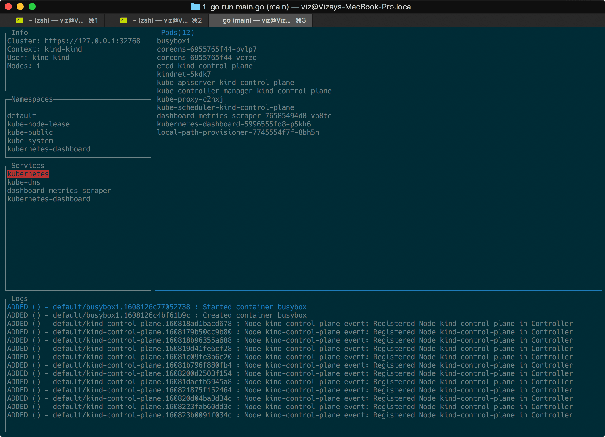
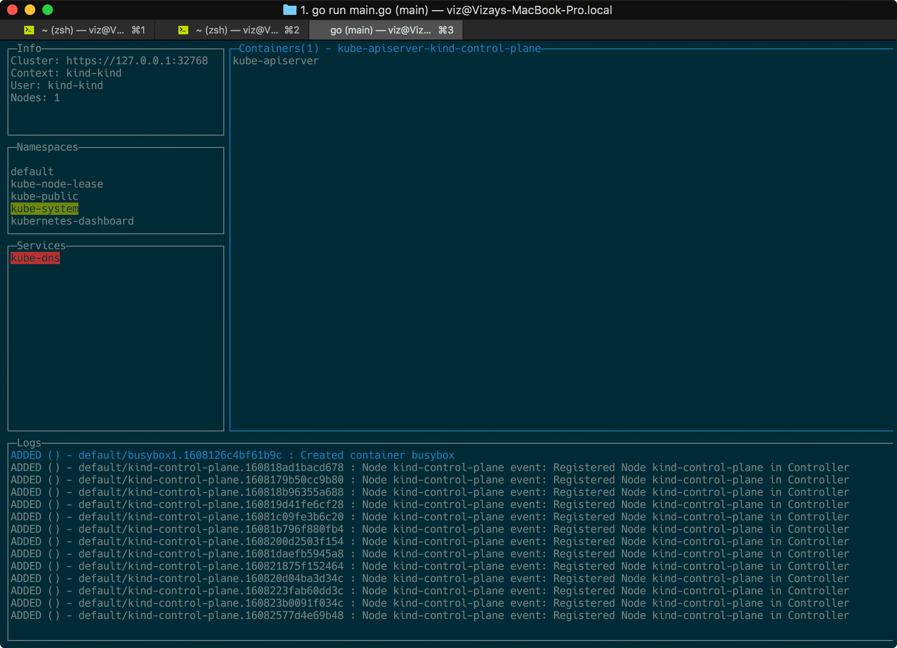
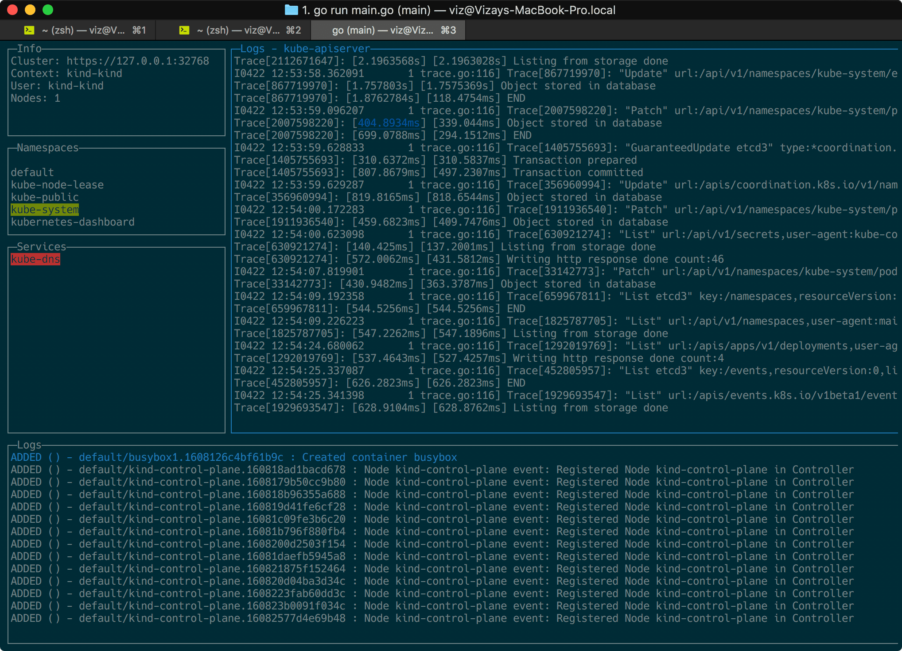

# lazykubectl
A Terminal UI client for kubernetes

> NOTE: _this project is still in an early stage_

[](https://github.com/vs4vijay/lazykubectl/releases)
[](https://github.com/vs4vijay/lazykubectl/releases/latest)
[](https://goreportcard.com/report/github.com/vs4vijay/lazykubectl)
[](https://github.com/vs4vijay/lazykubectl)
[](http://godoc.org/github.com/vs4vijay/lazykubectl)
[](https://github.com/vs4vijay/lazykubectl/releases)

---

## Installation

### Homebrew

```
brew install vs4vijay/tap/lazykubectl
```

### Release Binaries

- https://github.com/vs4vijay/lazykubectl/releases

### Via GoBinaries

```shell script
curl -sf https://gobinaries.com/vs4vijay/lazykubectl | sh
```

---

## Running

```
lazykubectl
```

---

## Screenshots








---

## References
- https://pkg.go.dev/k8s.io/client-go/kubernetes?tab=doc
- https://kubernetes.io/docs/reference/generated/kubernetes-api/v1.10/

---

## ToDo
- [x] Auth
- [x] Custom Error Handler, for custom errors
- [ ] Proper Logger
- [x] CORS
- [x] Validator
- [ ] Version
- [ ] ENV
- Handle Up / Down Arrow
- Stream Logs
- Events
- CPU
- MEM
- View Logs
- Execute Shell

---

## License

[MIT](LICENSE)

---

### Development Notes

```go


// Echo Error Handler

e.HTTPErrorHandler = func(err error, c echo.Context) {
    // Take required information from error and context and send it to a service like New Relic
    fmt.Println(c.Path(), c.QueryParams(), err.Error())

    switch err.(type) {
    case orchestrator.CustomError:
        fmt.Println("custom")
    default:
        fmt.Println("normal") // here v has type interface{}
    }

    // Call the default handler to return the HTTP response
    e.DefaultHTTPErrorHandler(err, c)
}


// Docker 

import (
    "github.com/docker/docker/client"
    "github.com/docker/docker/api/types"
)

cli, err := client.NewEnvClient()
cli.Info(context.Background())
cli.DiskUsage(context.Background())
cli.ContainerList(context.Background(), types.ContainerListOptions{All: true})

Client.ContainerList(context.Background(), types.ContainerListOptions{All: true})
stream, err := c.Client.ContainerStats(context.Background(), container.ID, true)
images, err := c.Client.ImageList(context.Background(), types.ImageListOptions{})
result, err := c.Client.VolumeList(context.Background(), filters.Args{})


// Kubernetes

import (
    "k8s.io/client-go/kubernetes"
    "k8s.io/client-go/tools/clientcmd"
)

clientConfig := clientcmd.NewNonInteractiveDeferredLoadingClientConfig(
		&clientcmd.ClientConfigLoadingRules{ExplicitPath: kubeconfig},
		&clientcmd.ConfigOverrides{CurrentContext: kubeContext})

rawConfig, err := clientConfig.RawConfig()
rawConfig.CurrentContext


// Watcher

watch, _ := api.Services("").Watch(metav1.ListOptions{})

go func() {
    for event := range watch.ResultChan() {
        fmt.Printf("Type: %v\n", event.Type)
        p, ok := event.Object.(*v1.Pod)
        if !ok {
            log.Fatal("unexpected type")
        }
        fmt.Println(p.Status.ContainerStatuses)
        fmt.Println(p.Status.Phase)
    }
}()

time.Sleep(5 * time.Second)


// Controller

https://engineering.bitnami.com/articles/a-deep-dive-into-kubernetes-controllers.html
https://engineering.bitnami.com/articles/kubewatch-an-example-of-kubernetes-custom-controller.html

cache.NewInformer
NewSharedIndexInformer
---
lw := cache.NewListWatchFromClient()
sharedInformer := cache.NewSharedInformer(lw, &api.Pod{}, resyncPeriod)
---
factory := informers.NewSharedInformerFactory(clientset, 0)
informer := factory.Core().V1().Nodes().Informer()
stopper := make(chan struct{})
defer close(stopper)
defer runtime.HandleCrash()
informer.AddEventHandler(cache.ResourceEventHandlerFuncs{
    AddFunc: onAdd,
})
go informer.Run(stopper)

// Informer

watchlist := cache.NewListWatchFromClient(clientset.Core().RESTClient(), "pods", "", fields.Everything())
_, controller := cache.NewInformer(
    watchlist,
    &v1.Pod{},
    time.Second * 0,
    cache.ResourceEventHandlerFuncs{
        AddFunc: func(obj interface{}) {
            fmt.Printf("add: %s \n", obj)
        },
        DeleteFunc: func(obj interface{}) {
            fmt.Printf("delete: %s \n", obj)
        },
        UpdateFunc:func(oldObj, newObj interface{}) {
            fmt.Printf("old: %s, new: %s \n", oldObj, newObj)
        },
    },
)
stop := make(chan struct{})
go controller.Run(stop)


// Shared Index Informer

informer := cache.NewSharedIndexInformer(
        &cache.ListWatch{
            ListFunc: func(options meta_v1.ListOptions) (runtime.Object, error) {
                return kubeClient.CoreV1().Pods(conf.Namespace).List(options)
            },
            WatchFunc: func(options meta_v1.ListOptions) (watch.Interface, error) {
                return kubeClient.CoreV1().Pods(conf.Namespace).Watch(options)
            },
        },
        &api_v1.Pod{},
        0, //Skip resync
        cache.Indexers{},
    )


if v, err := g.SetView("help", maxX-25, 0, maxX-1, 9); err != nil {
    if err != gocui.ErrUnknownView {
        return err
    }
    fmt.Fprintln(v, "KEYBINDINGS")
    fmt.Fprintln(v, "Space: New View")
    fmt.Fprintln(v, "Tab: Next View")
    fmt.Fprintln(v, "← ↑ → ↓: Move View")
    fmt.Fprintln(v, "Backspace: Delete View")
    fmt.Fprintln(v, "t: Set view on top")
    fmt.Fprintln(v, "b: Set view on bottom")
    fmt.Fprintln(v, "^C: Exit")
}


func Loader() string {
	characters := "|/-\\"
	now := time.Now()
	nanos := now.UnixNano()
	index := nanos / 50000000 % int64(len(characters))
	return characters[index : index+1]
}


https://github.com/alitari/kubexp

https://github.com/JulienBreux/pody

https://stackoverflow.com/questions/40975307/how-to-watch-events-on-a-kubernetes-service-using-its-go-client

https://github.com/NetApp/trident/blob/master/k8s_client/k8s_client.go
https://github.com/vladimirvivien/k8s-client-examples
https://github.com/dtan4/k8stail/blob/master/tail.go


Test Data:

https://raw.githubusercontent.com/kubernetes/kubernetes/master/hack/testdata/recursive/pod/pod/busybox.yaml
https://raw.githubusercontent.com/istio/istio/master/samples/sleep/sleep.yaml


kubectl create clusterrolebinding dashboard-admin-sa --clusterrole=cluster-admin --serviceaccount=default:dashboard-admin-sa

kubectl describe secret dashboard-admin-sa-token-kw7vn

kubectl get secret $(kubectl get serviceaccount dashboard -o jsonpath="{.secrets[0].name}") -o jsonpath="{.data.token}" | base64 --decode

curl -fsSL https://raw.githubusercontent.com/micro/micro/master/scripts/install.sh | /bin/bash

```